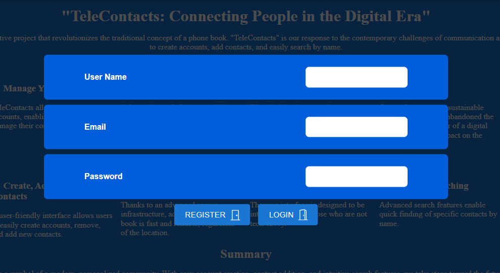
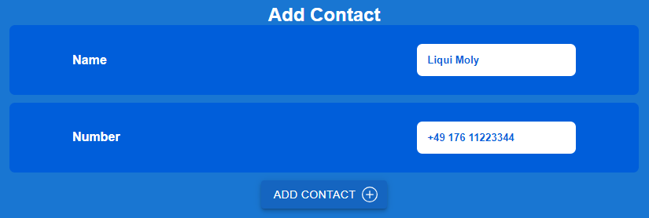

**Przeczytaj w innym języku: [polski](README.pl.md).**

# PhonebookApp

Simple phonebook app created to allow manage your contact list. Register or Login to get your own
phonebook. Add contact name and number. App will add contact to your list. You can easy delete
unwanted contact from your phoenbook. Created with React.js, HTML, CSS, JS, and a bit of passion...

---

## Demo

Here is working live demo: ( https://krystianklimczak.github.io/goit-react-hw-08-phonebook/ )

---

## Site

### Leading page

### Create your own phonebook account or login if you already have registered

### Simply just click to add your new contact

### You can always delete contact from your list

---

## Technologies

- HTML
- CSS
- JavaScript
- React.js

---

## Setup

Clone this repo to your desktop and run `npm install` to install all the dependencies.

---

## Usage

After you clone this repo to your desktop, go to its root directory and run `npm install` to install
its dependencies.

Once the dependencies are installed, you can run `npm start` to start the application. You will then
be able to acces it at localhost:3000

---

## Feel free to share your opinion

- https://www.linkedin.com/in/klima96/
