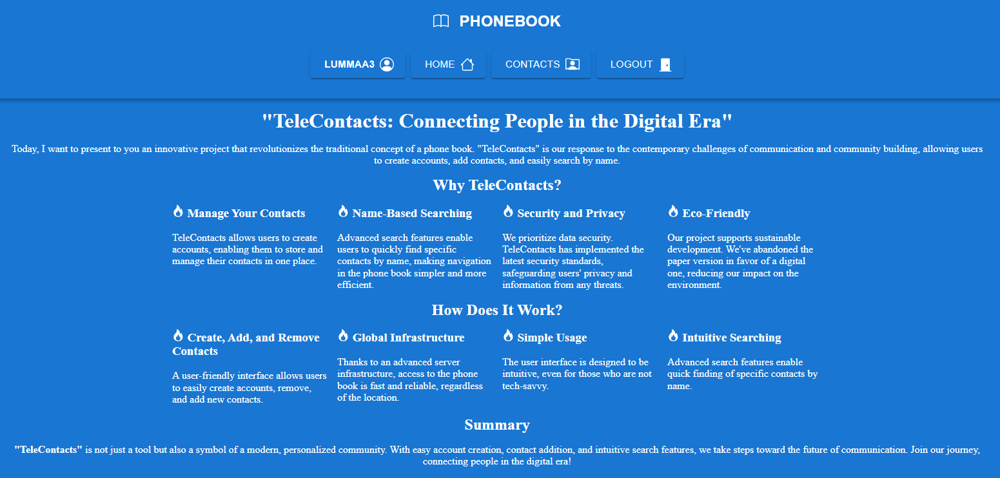
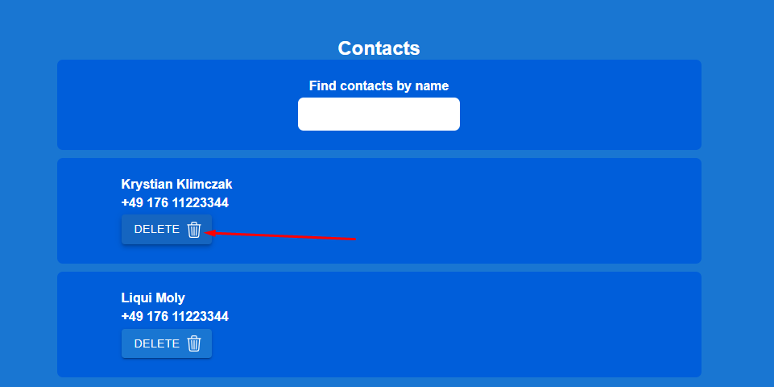

**Przeczytaj w innym języku: [polski](README.pl.md).**

# PhonebookApp

Simple phonebook app created to allow you to add contact to your contact list.
Add contact name and number. 
App will add contact to your list. 
Created with React.js, HTML, CSS, JS, and a bit of passion...

## Demo
Here is working live demo: ( https://krystianklimczak.github.io/goit-react-hw-02-phonebook/ )

## Site

### Leading page

### Simply just click to add your new contact

### You can always delete contact from your list

## Technologies
- HTML
- CSS
- JavaScript
- React.js

## Feel free to share your opinion
- https://www.linkedin.com/in/klima96/ 