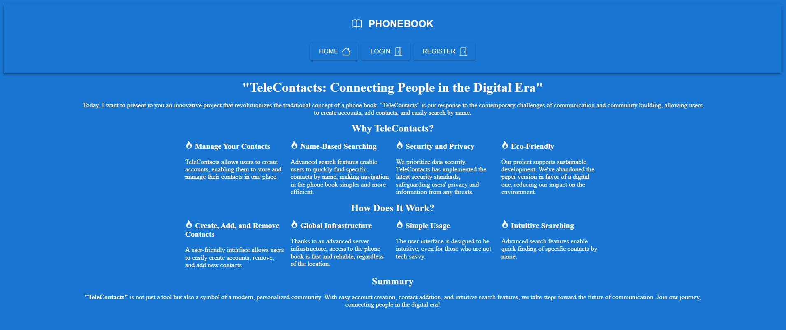
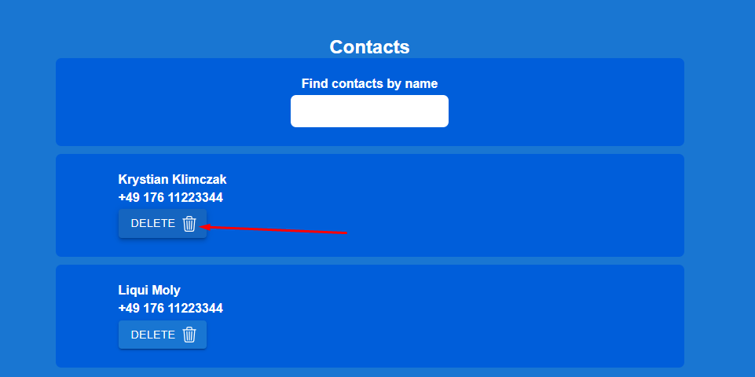

**Przeczytaj w innym języku: [english](README.md).**

# PhonebookApp

Prosta aplikacja pozwalający użytkownikowi dodać kontakty do listy. 
Wprowadź nazwę użytkownika oraz jego numer.
App doda wprowadzony kontakt do twojej listy.
Utworzone z React.js, HTML, CSS, JS, i odrobiną pasji...

## Demo
Sprawdź jak działa: ( https://krystianklimczak.github.io/goit-react-hw-02-phonebook/ )

## Site

### Strona główna

### Po prostu kliknij aby dodać nowy kontakt

### Zawsze możesz usunąć kontakt ze swojej listy

## Użyte tecnnologie
- HTML
- CSS
- JavaScript
- React.js

## Daj mi znać co powinienem zmienić, lub co Ci się spodobało
- https://www.linkedin.com/in/klima96/ 